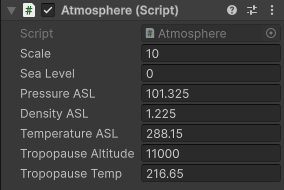
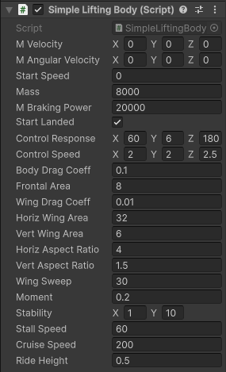
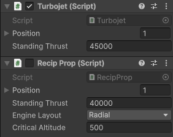
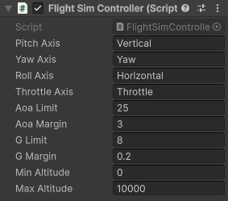

# "Sparky" Unity Semi-Realistic Flight Simulation Module

"Sparky" is a semi-realistic flight simulation module designed to exibit the expected first-order effects of fixed-wing flight, while also remaining easy to understand and use for non-pilots.
Accurate simulation is not a goal of this project. Rather, making players "feel" like a pilot is top priority.

This module was originally intended for a game I was making, but between life circumstances putting the game on hold for a few years, Unity deprecating their old networking code which I had been using, and Unity's runtime fee fiasco,
that project has been dropped. However, this module has been left in working condition.

## Features

### Adjustable Atmosphere

Different atmospheric conditions can be set to simulate different environments. Just attach the `Atmosphere` script to a root-level object in your scene tree, and your aircraft will find it.

### Modular Aircraft

The basis of an aircraft in "Sparky" is the `SimpleLiftingBody` script.
This is the script that allows you to define the flight characteristics of your aircraft.
Note that this script assumes that there is also a `Rigidbody` on the same `GameObject`, and that this `Rigidbody` `Is Kinematic`.

While aircraft don't technically require an engine, you will need one if you want a fully-qualified aeroplane rather than a glider.
"Sparky" comes with `RecipProp` and `TurboJet` scripts which you can add to your aircraft `GameObject` alongside the `SimpleLiftingBody` for that purpose.
Additionally, "Sparky" provides the abstract class `AEngine` which you can extend to define your own engine types.

Finally, your aircraft will need to be controllable somehow.
To make the aircraft controlled by the player, attach a `FlightSimController` to the aircraft.
However, you can extend the `APilot` abstract class to make computer-controlled aircraft.

### Test Scene

The project includes a basic test scene, called `testScene`, which you can use to get a feel for using "Sparky" as a developer, as well as a player.
Adjust the parameters on the `Cube`'s aircraft components, and see how it flies differently!

